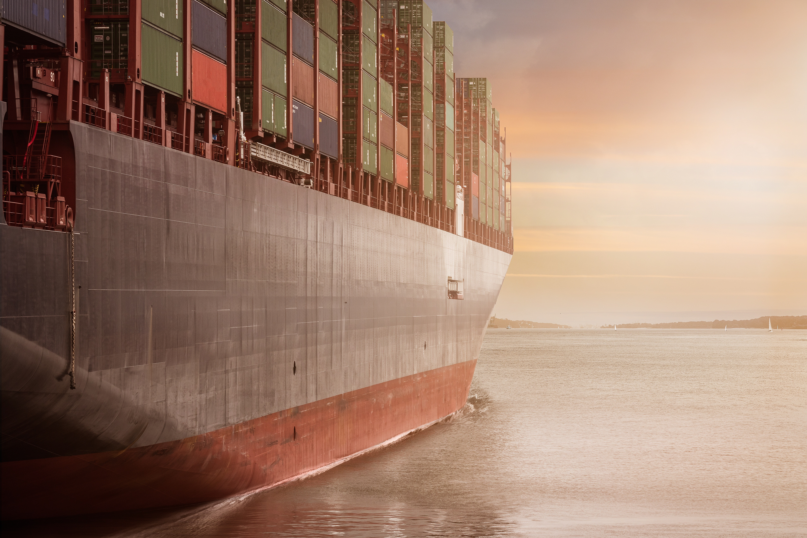

# Northwind_analysis
This is a Maven Northwind Challenge I participated in to demonstrate my data visualization skills by building a top-level KPI dashboard for the executive team.

Photo from [Pexels](https://www.pexels.com/photo/business-cargo-cargo-container-city-262353/)

## Introduction
Northwind Traders are a global import and export company that specializes in supplying high-quality gourmet food products to restaurants, cafes, and specialty food retailers around the world. As part of the challenge, we've been tasked with building a top-level KPI dashboard for the executive team. Its purpose should be to allow them to quickly understand the company's performance in key areas, including:
- Sales trends
- Product performance
- Key customers
- Shipping costs

## Problem Statement
The Executive team needs a top-level KPI dashboard to allow them to quickly understand the company's performance.

## Skills Involved
- **Excel** for data cleaning
- **Tableau** for the dashboard design

## Data Sourcing
The dataset was gotten from [Maven Analytics](https://mavenanalytics.io/challenges/maven-northwind-challenge/24).
It contains 7 related tables.

## Analysis and Visualization

Here's the link to the [interactive dashboard](https://public.tableau.com/app/profile/esther.ajuzieogu/viz/NorthwindTraders_16861440753380/Dashboard1)

From the dashboard, here are some observations:
- Northwind traders generated $1.27 million in sales between July 2013 and May 2015; with $1.2 million in profits excluding shipping costs.
- The number of clients increased by 12.73% in 2014, adding 19 new clients. Sales reached their peak in May 2015 with a total of $123,799 despite a decline in the overall number of clients. 
- The top category was beverages, while Côte de Blaye generated the most income and Camembert Pierrot sold the most. 
- The largest revenue was generated by QUICK-Stop, the top client.
- Northwind traders had a total of 830 orders from 69 cities in 21 countries. Europe and North America are the two customer regions that generated the highest revenue with USA toping the charts. 
- Customers typically place more orders on Wednesdays, but Fridays are seen to generate more income. 
- Margaret Peacock is the employee who made the biggest contribution to the overall income.

## Recommendations
- Given the 12.73% rise in clients in 2014, it is critical to keep putting emphasis on client acquisition and retention techniques.
- Beverages offer a tremendous possibility for expansion as the leading category. To extend the product line and increase market share, conduct market research to uncover new trends, launch new beverage products, and consider forming relationships with regional or worldwide beverage suppliers.
- It's important to keep a solid relationship with QUICK-Stop as your top client. A dedicated account manager should be assigned to the account to give individualised care, swiftly address any issues, and look for chances to upsell or cross-sell additional goods to boost revenue from this important account.
- Develop localised marketing plans, partner with distributors or agents in those territories to implement those tactics, and do market research to find possible regions with significant development potential.
- Profit from patterns in consumer behaviour by concentrating on Wednesdays to boost order volume and Fridays to boost revenue. Run targeted campaigns, provide special offers or discounts, and use email or social media marketing to encourage customers to buy more on these particular days.
- Acknowledge Margaret Peacock's significant contribution to the overall income. It is important to recognize the dedication and fortitude of Northwind's top staff so that they remain motivated. 

  
